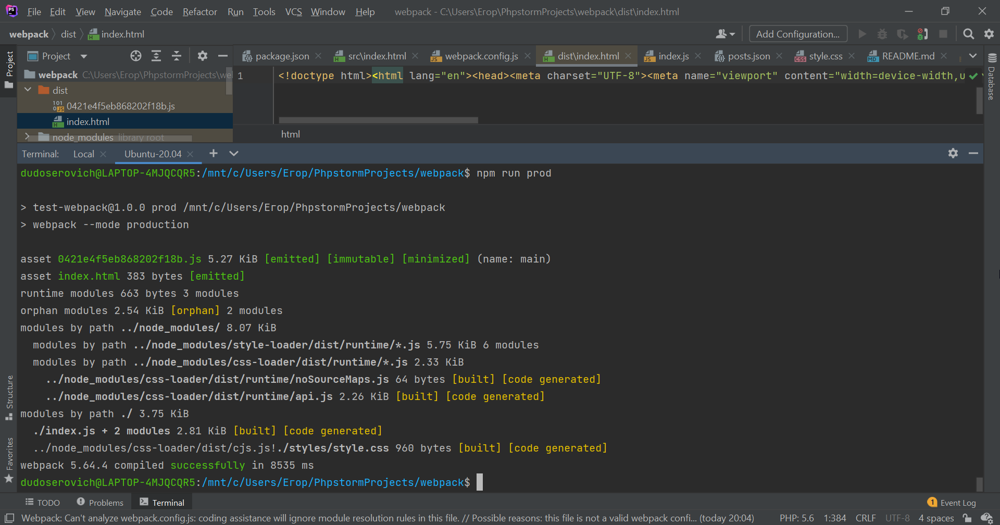
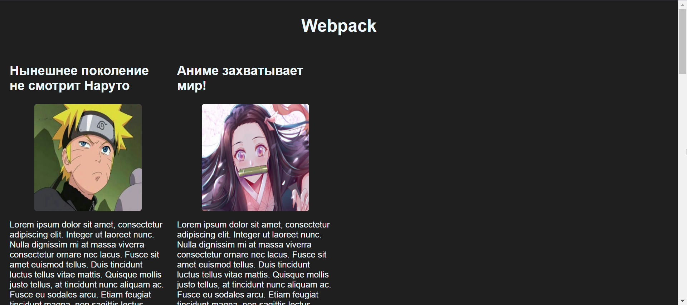

# Webpack
### Сборка приложения

### Работа в браузере

Сайт простецкий, просто на основе 
json файла на сервере с помощью ajax, как 
в лр ArtStation, формирую уже отдельные блоки. 
Только тут уже некий блог с постами.